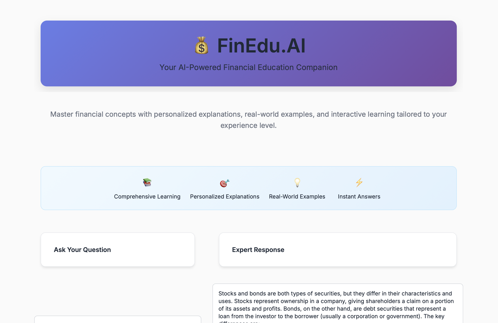
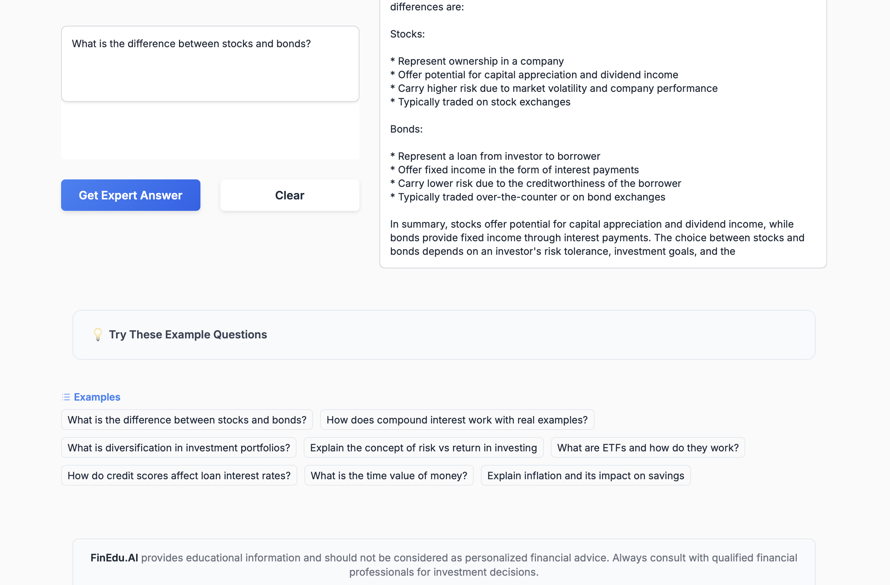
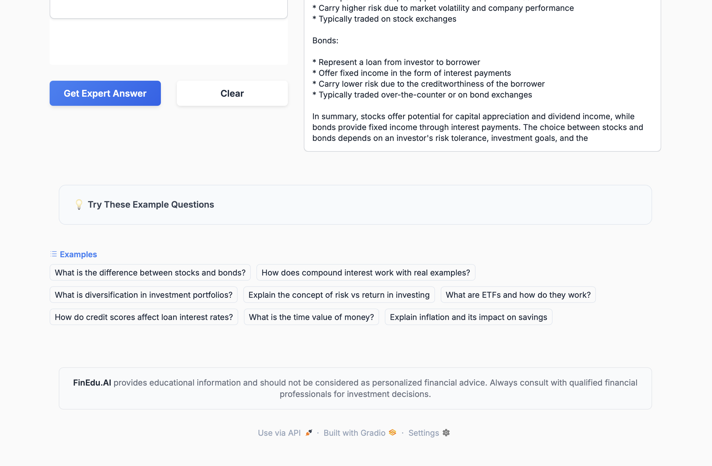

# FinEdu.AI 🚀💰

**Making Financial Literacy Accessible with AI**

FinEdu.AI is an innovative AI-powered platform designed to democratize financial education and make complex financial concepts accessible to everyone. By leveraging advanced machine learning models and natural language processing, this project transforms how people learn about finance, investments, and economic principles.

## 🌟 Features

- **AI-Powered Financial Assistant**: Interactive chatbot that explains complex financial terminology in simple terms
- **Comprehensive Financial Database**: Curated dataset of 80+ financial terms with definitions, significance, usage, and implications
- **Personalized Learning**: Adaptive learning system that adjusts to user's knowledge level
- **Real-time Financial Insights**: Get explanations for trending financial concepts and market terminology

## 🛠️ Technology Stack

- **Python 3.8+**
- **Transformers** - Hugging Face transformers for NLP models
- **Sentence Transformers** - For semantic similarity and embeddings
- **PyTorch** - Deep learning framework
- **Pandas** - Data manipulation and analysis
- **Kaggle Hub** - Dataset management
- **Jupyter Notebook** - Development environment
- **Meta Llama-2-7b-chat-hf** - Main language model (8-bit quantized)
- **LlamaIndex** - For vector storage and retrieval
- **Gradio** - For the web interface

## 📊 Dataset

The project utilizes a comprehensive financial terminology dataset containing:
- **80 financial terms** with detailed explanations
- **Definitions** - Clear, concise explanations of each term
- **Significance** - Why each concept matters in finance
- **Usage** - Practical applications in real-world scenarios
- **Implications** - What increasing/decreasing values mean

Dataset source: [Financial Terminologies on Kaggle](https://www.kaggle.com/datasets/ayansk11/financial-terminologies)

## 🚀 Getting Started

### Prerequisites
```bash
pip install torch transformers sentence-transformers pandas kagglehub jupyter
```

**Run the Jupyter notebook**
```bash
jupyter notebook FinEduAI.ipynb
```

<br>

### OR

<br>

### Installation

1. **Clone the repository**
```bash
git clone https://github.com/ayansk11/FinEdu.AI.git
cd FinEdu.AI
```

2. **Install dependencies**
```bash
pip install -r requirements.txt
```

3. **Run the Python File**
```bash
python FinEduAI.py
```


### Usage

1. **Load the financial dataset**
```python
import kagglehub
import pandas as pd

# Download dataset
path = kagglehub.dataset_download("ayansk11/financial-terminologies")
df = pd.read_json(path + "/financialdata.jsonl", lines=True)
```

2. **Initialize the AI model**
```python
from transformers import pipeline, AutoTokenizer, AutoModel

# Load pre-trained models for financial NLP
model = AutoModel.from_pretrained('sentence-transformers/all-MiniLM-L6-v2')
```

3. **Start learning**
```python
# Ask questions about financial terms
query = "What is Price-to-Earnings Ratio?"
# Get AI-powered explanations with context and examples
```

## 📈 Key Components

### 1. Financial Term Classifier
- Automatically categorizes financial queries
- Understands context and user intent
- Provides relevant explanations

### 2. Semantic Search Engine
- Find related financial concepts
- Semantic similarity matching
- Contextual recommendations

### 3. Interactive Learning Module
- Progressive difficulty levels
- Personalized learning paths
- Real-time feedback and corrections

## 🎯 Use Cases

- **Students** - Learn financial concepts for academic purposes
- **Investors** - Understand market terminology and investment strategies  
- **Professionals** - Quick reference for financial jargon and concepts
- **General Public** - Improve financial literacy and decision-making skills

## 🤝 Contributing

We welcome contributions from the community! Here's how you can help:

1. **Fork the repository**
2. **Create a feature branch** (`git checkout -b feature/AmazingFeature`)
3. **Commit your changes** (`git commit -m 'Add some AmazingFeature'`)
4. **Push to the branch** (`git push origin feature/AmazingFeature`)
5. **Open a Pull Request**

### Areas for Contribution
- Adding new financial terms and definitions
- Improving AI model accuracy
- Developing web/mobile interfaces
- Creating educational content
- Translating to other languages

## 📝 Future Roadmap

- [ ] **Web Application** - Browser-based interface
- [ ] **Mobile App** - iOS and Android applications  
- [ ] **Voice Assistant** - Audio-based financial education
- [ ] **Market Integration** - Real-time market data and analysis
- [ ] **Multilingual Support** - Support for multiple languages
- [ ] **Advanced Analytics** - Personal finance tracking and advice

## 🙏 Acknowledgments

- Kaggle community for providing the financial terminology dataset
- Hugging Face for transformer models and tools
- Open source contributors and financial education advocates

## 📞 Contact

**Ayan Shaikh** - [@ayansk11](https://github.com/ayansk11)

LinkedIn - https://www.linkedin.com/in/ayansk11/

Project Link: [https://github.com/ayansk11/FinEdu.AI](https://github.com/ayansk11/FinEdu.AI)

***

⭐ **Star this repository if you found it helpful!**

*"Empowering everyone with AI-driven financial knowledge"*


<br>





